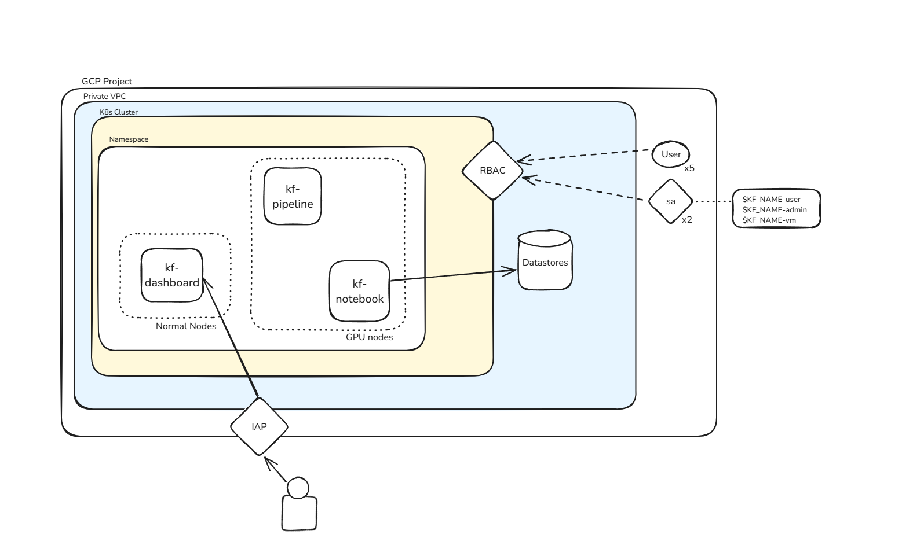

# Kubeflow GCP Infra Implementation Plan (PART 1)

## **1. High-Level Architecture**

### **Components Overview**
### 1. **Networking**:
   - A private VPC with subnets for workloads, ensuring no public IPs are
### 2. **Identity-Aware Proxy (IAP)**:
   - Secures access to private workloads using Google-managed access policies.
### 3. **GKE Cluster**:
   - A management cluster with RBAC and GPU-optimized node pools.
### 4. **IAM**:
   - Centralized user and service account management.
### 5. **CloudSQL**:
   - MySQL instance with private IP and integration with GKE.
### 6. **Storage**:
   - A GCS bucket and Filestore for durable and scalable storage. 

---

## **2. Implementation Decisions and Trade-Offs**

### **2.1 Networking**
- **Decision**: Use a private VPC with private subnets.
  - **Why**: Private networking ensures that no workloads are exposed to the public internet, significantly reducing the attack surface.
  - **CIDR Block**: Designed to allow future scaling the ammount of engineers working in the environment with room for additional subnets and integrations.
  - **Trade-Off**: Setting up private access may require additional complexity in configuring Identity-Aware Proxy and private Google services.
  - **Improvement Opportunities**:
    - Use **Shared VPC** if there are multiple projects that require interconnectivity.
    - Enable **VPC Service Controls** to protect against data exfiltration.

### **2.2 Identity-Aware Proxy (IAP)**
- **Decision**: Secure all workloads behind IAP.
  - **Why**: Provides a centralized access control layer with fine-grained permissions.
  - **Trade-Off**: Relies on Google-managed services, which may introduce operational overhead if custom authentication is required.
  - **Improvement Opportunities**:
    - Integrate IAP with an existing enterprise identity provider (e.g., Okta, Active Directory).
    - Configure access logs and monitoring for compliance and troubleshooting.

### **2.3 GKE Cluster**
- **Decision**: Deploy a single GKE cluster for managing other clusters.
  - **Why**: Centralized control for cluster management simplifies scaling and ensures consistency.
  - **RBAC**: Assign roles to service accounts and users for fine-grained access.
  - **GPU Node Pool**: Uses `a2-highgpu-1g` optimized for trading model training.
  - **Trade-Off**:
    - Managing all clusters through one GKE cluster may introduce a single point of failure.
    - GPU costs are higher; workloads should be optimized for GPU utilization.
  - **Improvement Opportunities**:
    - Enable **Vertical Pod Autoscaler (VPA)** for GPU nodes to optimize resource usage.
    - Use **Node Affinity** to isolate workloads to specific node pools for security and efficiency.

### **2.4 IAM**
- **Decision**: Manage users and service accounts via Terraform.
  - **Why**: Centralized IAM management ensures consistent and auditable access control.
  - **Trade-Off**:
    - New IAM roles or permissions require Terraform changes, which may slow down immediate access adjustments.
  - **Improvement Opportunities**:
    - More granular control over permissions for each kind of user through code.
    - Use **IAM Conditions** for time-based or attribute-based access policies.
    - Integrate with **Google Workspace Groups** to simplify user role assignments.

### **2.5 CloudSQL**
- **Decision**: Use a MySQL instance without high availability.
  - **Why**: Reduces cost while meeting current requirements.
  - **Private IP**: Ensures that the database is accessible only within the VPC.
  - **Trade-Off**:
    - No HA means downtime in case of instance failure; manual failover or recovery would be required.
  - **Improvement Opportunities**:
    - Enable **Point-in-Time Recovery** for disaster recovery.
    - Consider **Cloud SQL Insights** for monitoring and performance tuning.

### **2.6 Storage**
- **Decision**: Use a GCS bucket for object storage and Filestore for shared file access.
  - **Why**: Combines scalability with high availability.
  - **Trade-Off**:
    - Filestore is regional and requires manual replication for multi-region resilience.
  - **Improvement Opportunities**:
    - Use **Bucket Lock** for compliance requirements (WORM policy).
    - Implement **Backup Policies** for Filestore.

---

## **3. Security Best Practices**
1. **Networking**:
   - Use **Firewall Rules** to restrict access to specific subnets or IPs.
   - Enable **Private Google Access** for API calls from the VPC.
2. **IAM**:
   - Implement **Least Privilege** for service accounts and users.
   - Regularly rotate keys and monitor service account usage.
3. **Data Protection**:
   - Use **Customer-Managed Encryption Keys (CMEK)** for sensitive workloads.
   - Enable **Cloud DLP** for identifying sensitive data in GCS.
4. **Monitoring and Auditing**:
   - Enable **Cloud Logging** and **Cloud Monitoring** for all resources.
   - Use **Security Command Center** for proactive threat detection.

---

## **4. Scalability Considerations**
1. **Networking**:
   - Reserve additional CIDR blocks for future subnets and integrations.
   - Use **Cloud Interconnect** or **VPN** for hybrid environments.
2. **GKE**:
   - Implement **Horizontal Pod Autoscaler (HPA)** for application workloads.
   - Use **Workload Identity** instead of service account keys for secure authentication.
3. **CloudSQL**:
   - Plan for HA or a managed read-replica configuration if workloads grow.
4. **Storage**:
   - Transition to **Coldline Storage** for archived data to reduce costs.

---

## **5. Documentation Plan**
The `READMEPART2.md` will:
1. **Explain Architecture**: High-level overview of components and their purpose.
2. **Describe Module Usage**: Briefly describe how to implement the code
3. **Provide Runbooks (TO DO)**:
   - Steps for common operations (e.g., scaling GPU nodes, adding IAM users).
   - Recovery procedures for CloudSQL and Filestore.